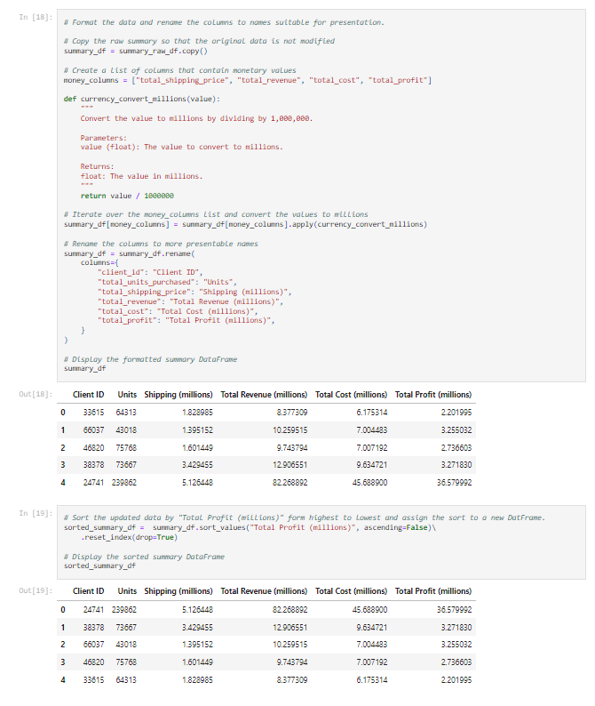

# pandas-challenge-1

## Description
In this challenge we dive into data analysis using Python's Pandas library. 

We'll be working with data from a fictional e-commerce company, and our goal is to get hands-on experience with exploring and transforming the data.  

By using Pandas, we'll manipulate the data from a CSV file to answer important questions, spotting trends, and calculating relevant numbers. This will help us see how data analysis can help us understand and make decisions from raw data.

## Table of Contents
- [Usage](#usage)
- [Credits](#credits)
- [Screenshot](#screenshot)

## Usage
> **To use...**  
1. Clone the repository to your local system using `git clone`
2. Open the `wholesale_data_analysis_starter_code.ipynb` file using Jupyter Labs
3. Then explore, transform, and analyze the data using the pandas library

## Credits
Starter code for this assignment was provided by [edX bootcamp](https://www.edx.org/boot-camps).

## Screenshot
>**Notebook Preview...**

  
 

